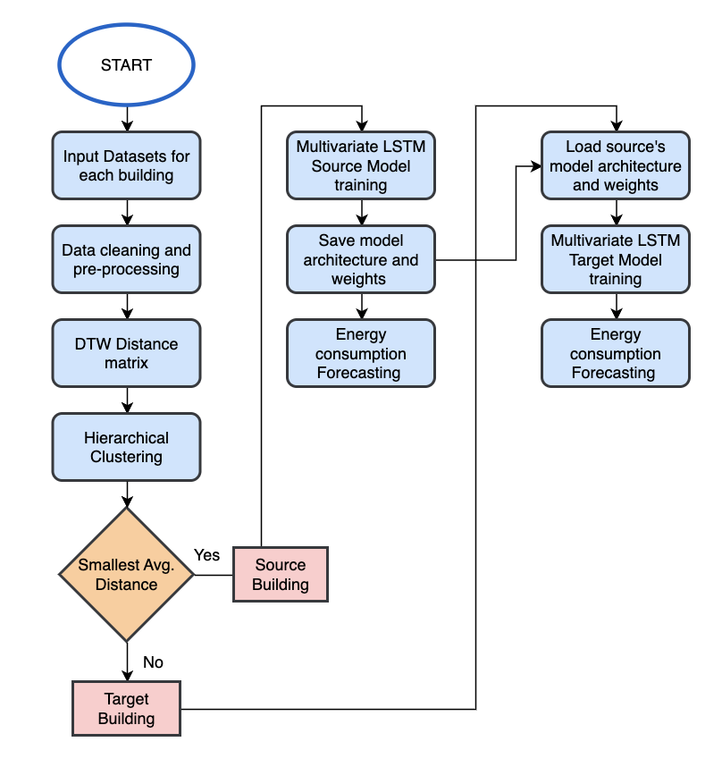

# A Transfer Learning Approach to Create Energy Forecasting Models for Building Fleets

This repository contains the following resources:

- Clustering algorithm: Hierarchical Clustering method with Dynamic Time Warping (DTW) to group similar buildings together based on time series energy consumption.

- LSTM model for source buildings: Multivariate LSTM with 7 time steps and 3 days forecasting for the source models.

- LSTM-Transfer Learning models for target buidlings: Multivariate LSTM with 7 time steps and 3 days forecasting for the target models plus the loading of the weights from the source model under different Transfer Learning strategies.

